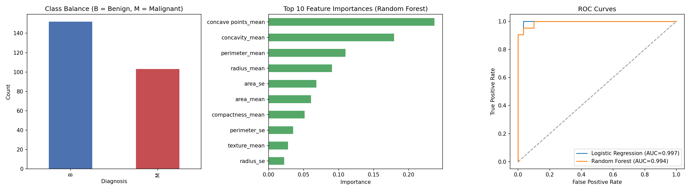

# Breast Cancer Classification

A machine learning project that classifies whether a breast tumor is **malignant** or **benign** using diagnostic measurements from the UCI Breast Cancer Wisconsin (Diagnostic) dataset.

## Background

This dataset was one of two project options during a data science program — the other being a telecom customer churn problem. I originally chose the churn project because it let me tell a stronger narrative connecting my telecom operations background to data science. This project revisits the road not taken, developed into a complete, portfolio-ready classification pipeline.

## Problem

Early and accurate detection of malignant tumors is critical in breast cancer diagnosis. This project builds a classifier that predicts diagnosis (malignant vs. benign) from 18 diagnostic features (radius, texture, perimeter, area, smoothness, compactness, concavity, symmetry, and their standard errors) computed from digitized images of breast mass fine needle aspirates.

## Dataset

- **Source:** UCI Machine Learning Repository — Breast Cancer Wisconsin (Diagnostic) Data Set
- **Samples:** 255 (152 benign, 103 malignant)
- **Features:** 18 numeric diagnostic measurements (mean and standard error variants)
- **Target:** `diagnosis` — M (malignant) / B (benign)

## Approach

1. Cleaned and encoded the target variable (M → 1, B → 0)
2. Split into train/test sets (80/20, stratified to preserve class balance)
3. Scaled features for the logistic regression model
4. Trained two classifiers: **Logistic Regression** and **Random Forest**
5. Evaluated with accuracy, precision, recall, F1, and ROC-AUC
6. Visualized class balance, feature importance, and ROC curves

## Results

| Model | Accuracy | Precision | Recall | F1 | ROC-AUC |
|---|---|---|---|---|---|
| Logistic Regression | 0.941 | 0.950 | 0.905 | 0.927 | 0.997 |
| **Random Forest** | **0.961** | 0.952 | 0.952 | 0.952 | 0.994 |

Random Forest was the stronger overall performer, correctly classifying 49 of 51 test cases, with only 1 false negative — an important metric to minimize in a cancer-screening context.

**Top predictive features:** `concave points_mean`, `concavity_mean`, and `perimeter_mean` — consistent with clinical understanding that irregular, jagged tumor boundaries are strong malignancy indicators.



## Tech Stack

- Python, pandas, NumPy
- scikit-learn (Logistic Regression, Random Forest, model evaluation)
- Matplotlib (visualization)

## Running It

```bash
pip install -r requirements.txt
python analysis.py
```

Outputs `results.png` (visualizations) and `metrics_summary.txt` (full metrics).

## What I'd Explore Next

- Cross-validation for more robust performance estimates
- Hyperparameter tuning (GridSearchCV) on the Random Forest
- SHAP values for more interpretable feature-importance explanations
